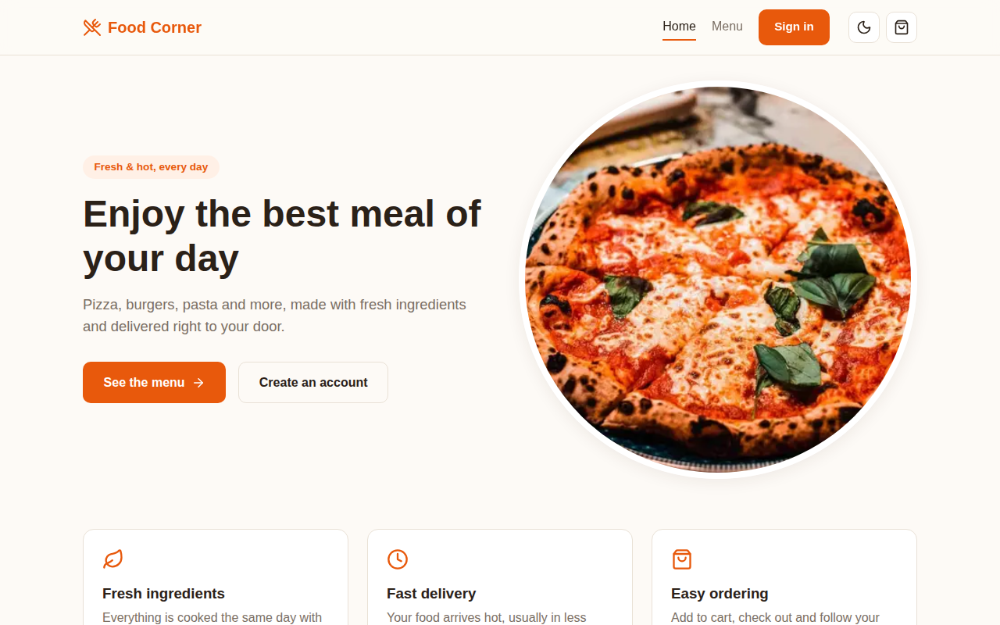
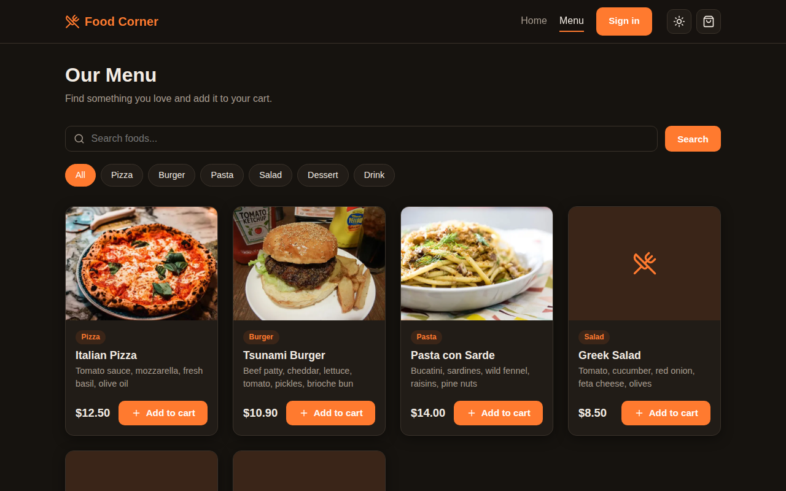
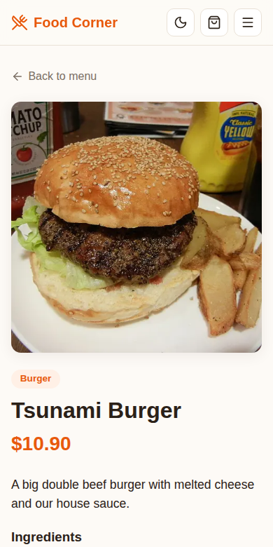
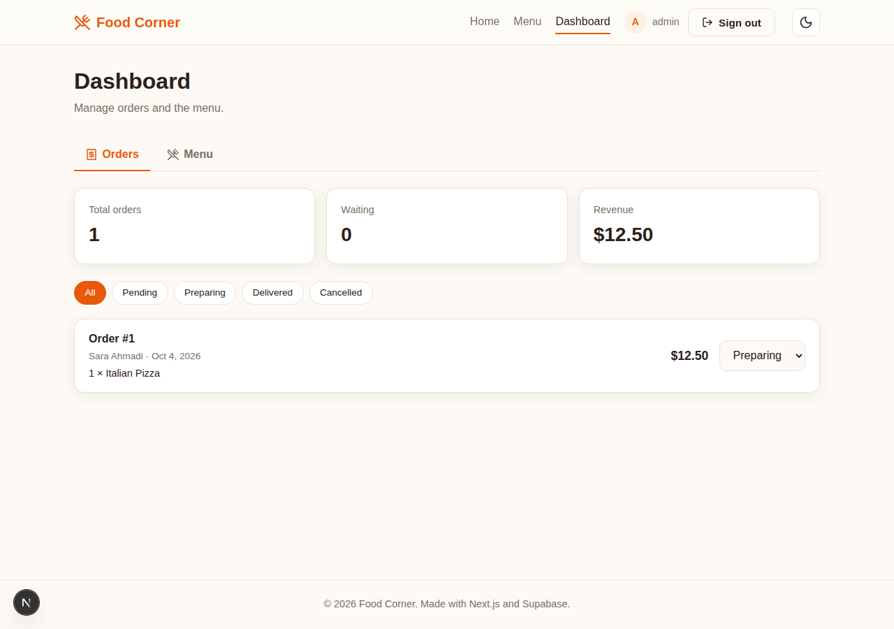

# Food Corner

A small food ordering app built with **Next.js (App Router)** and **Supabase**.

The app has two roles:

- **Customers** browse the menu, order food, save favorites, write reviews and change their avatar.
- **Admins** manage the menu (add, edit and delete foods) and follow all orders from a dashboard.



## Features

- Menu with search and category filters (data is loaded on the server)
- Food detail pages with dynamic metadata
- Sign up / sign in with Supabase Auth
- Customer and admin roles, checked in the database with Row Level Security
- Admin dashboard: orders list with status filters, change order status, manage the menu
- Add and edit foods with image upload to Supabase Storage
- Cart saved in `localStorage`, checkout creates an order in the database
- Order prices are calculated on the server, not trusted from the browser
- Reviews with a 1-5 star rating and an average rating for each food
- Favorites saved per user
- Profile page with avatar upload, display name, order status, favorites and password change
- Confirm modals for signing out and deleting
- Protected pages (`/admin`, `/profile`) using Next.js proxy
- Dark mode (follows the system setting, can be toggled)
- Responsive layout with a mobile menu
- Row Level Security on all tables

| Menu (dark mode) | Mobile |
| --- | --- |
|  |  |



## Tech stack

- [Next.js 16](https://nextjs.org/) with the App Router, Server Components and Server Actions
- [React 19](https://react.dev/) (`useActionState`, `useTransition`)
- [Supabase](https://supabase.com/) for the database, auth and file storage
- CSS Modules with CSS variables for theming
- [lucide-react](https://lucide.dev/) for icons
- [Vitest](https://vitest.dev/) for unit tests

## Project structure

```
app/
  page.js              home page
  foods/               menu, food details, reviews and favorites
  admin/               dashboard for orders and the menu (admins only)
  cart/                cart page and checkout action
  login/               sign in / sign up
  profile/             avatar, orders, favorites and password change
components/            shared UI components
context/CartContext.js cart state (useReducer + localStorage)
lib/                   supabase clients, data functions and helpers
supabase/              database schema and seed data
proxy.js               refreshes the session and protects pages
```

## Getting started

### 1. Create a Supabase project

1. Create a free project on [supabase.com](https://supabase.com/).
2. Open the **SQL Editor** and run these files in order:
   - `supabase/schema.sql`
   - `supabase/seed.sql`
   - `supabase/roles-and-reviews.sql`
3. In **Authentication > Providers > Email** you can turn off "Confirm email" if you want to sign in right after sign up.
4. Sign up in the app, then make your account an admin in the SQL Editor:

```sql
update public.profiles
set role = 'admin'
where id = (select id from auth.users where email = 'you@example.com');
```

Every new account is a customer by default.

### 2. Set up the project

```bash
npm install
cp .env.example .env.local
```

Put your project URL and anon key (from **Project Settings > API**) in `.env.local`:

```
NEXT_PUBLIC_SUPABASE_URL=https://your-project.supabase.co
NEXT_PUBLIC_SUPABASE_ANON_KEY=your-anon-key
```

### 3. Run it

```bash
npm run dev
```

Open [http://localhost:3000](http://localhost:3000).

## Scripts

| Command | Description |
| --- | --- |
| `npm run dev` | Start the dev server |
| `npm run build` | Build for production |
| `npm start` | Run the production build |
| `npm run lint` | Run ESLint |
| `npm test` | Run unit tests |

## Deploy

The easiest way is [Vercel](https://vercel.com/new). Import the repository and add the two environment variables from `.env.local`.

## Notes

This was one of my first Next.js projects. It started with the Pages Router, Redux and Firebase, and I later rebuilt it with the App Router, Server Actions and Supabase.
